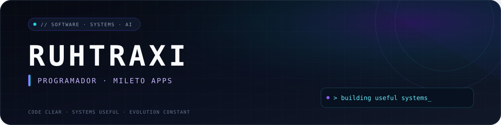

  

<code>software · systems · automation · ai</code>

 

Programador na <strong>Mileto Apps</strong>, desenvolvendo produtos digitais, automações e soluções com inteligência artificial.

---

### profile.ts

~~~ts
const ruhtraxi = {
  role: "Programador",
  company: "Mileto Apps",
  focus: [
    "Produtos digitais",
    "Automação",
    "IA aplicada",
  ],
  mindset: "Código claro. Sistemas úteis. Evolução constante.",
} as const;
~~~

### toolkit

  
  
  
  
  
  
  
  

### now

- Construindo produtos digitais com foco em utilidade e acabamento.
- Automatizando operações e transformando processos em sistemas.
- Explorando aplicações práticas de inteligência artificial.

 

  <code>building quietly. shipping consistently.</code>

