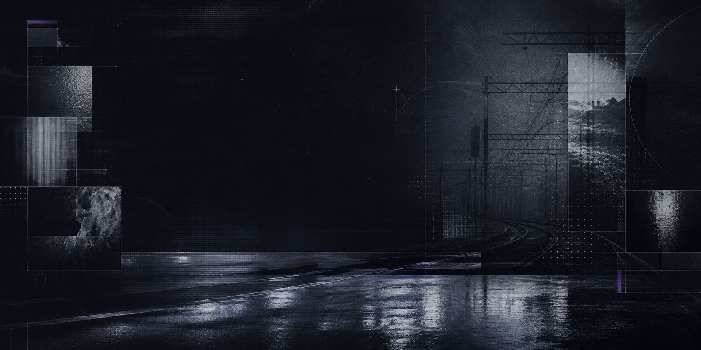

  

<h1 align="center">RUHTRAXI</h1>

  <samp>PROGRAMADOR @ MILETO APPS</samp>
   
  software · systems · automation · applied ai

---

<table>
  <tr>
    <td width="33%">01 / ROLE <strong>PROGRAMADOR</strong></td>
    <td width="33%">02 / COMPANY <strong>MILETO APPS</strong></td>
    <td width="34%">03 / MODE <strong>BUILD / ITERATE / SHIP</strong></td>
  </tr>
</table>

### `PROFILE / 01`

Programador na **[Mileto Apps](https://github.com/miletoapps)**, construindo produtos digitais, automações e soluções com inteligência artificial.

Meu trabalho cruza engenharia de software, design de sistemas e resolução prática de problemas — da ideia até uma entrega útil, clara e sustentável.

~~~ts
const ruhtraxi = {
  role: "Programador",
  company: "Mileto Apps",
  focus: ["Produtos digitais", "Automação", "IA aplicada"],
  principle: "Código claro. Sistemas úteis. Evolução constante.",
} as const;
~~~

### `SYSTEMS / 02`

- Arquitetando experiências e produtos digitais com atenção ao acabamento.
- Transformando processos operacionais em sistemas simples e confiáveis.
- Aplicando inteligência artificial onde ela realmente melhora o produto.

### `TOOLKIT / 03`

  
  
  
  
  
  
  
  

---

  <samp>BUILDING QUIETLY / SHIPPING CONSISTENTLY</samp>

